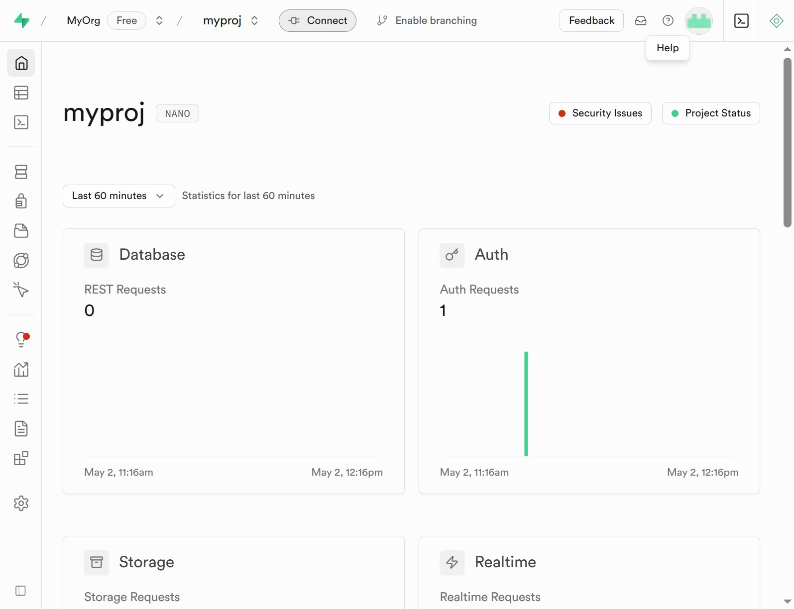
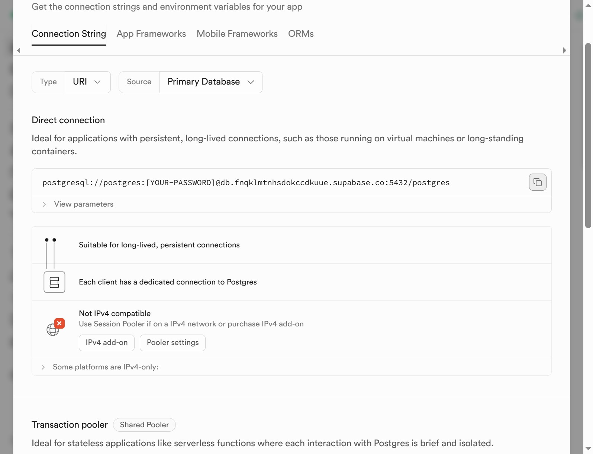
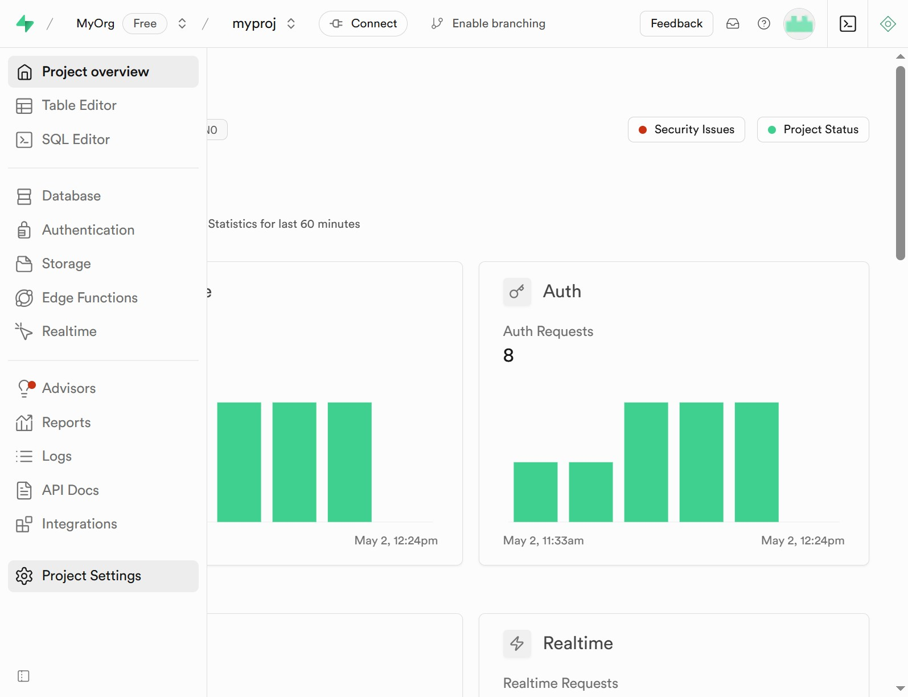
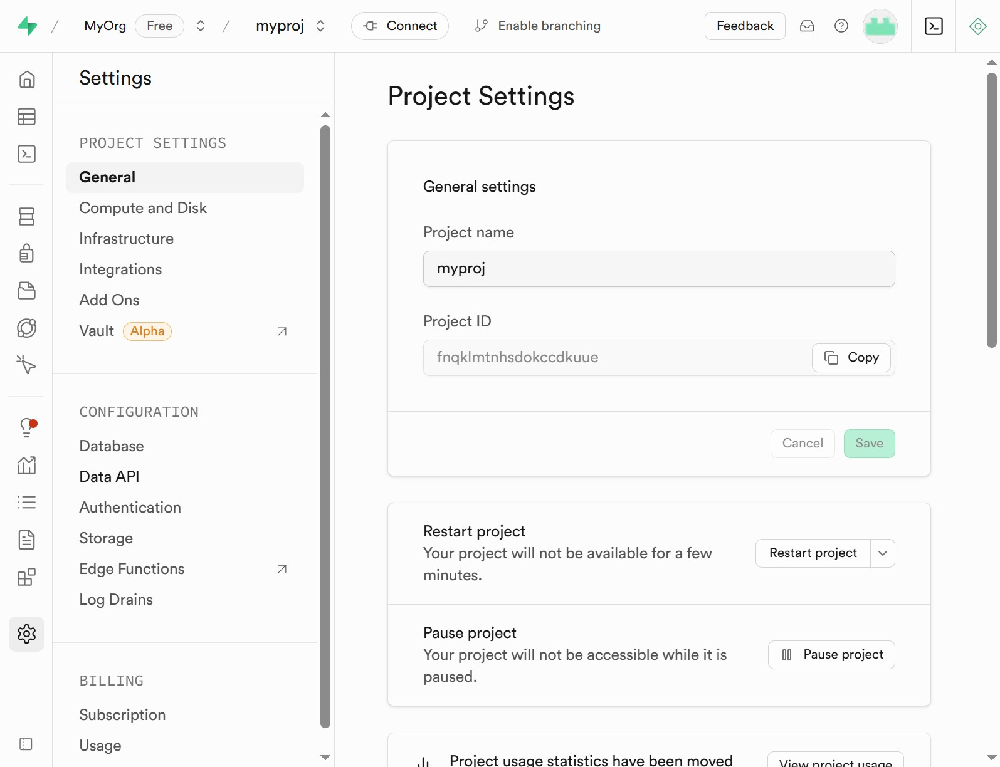
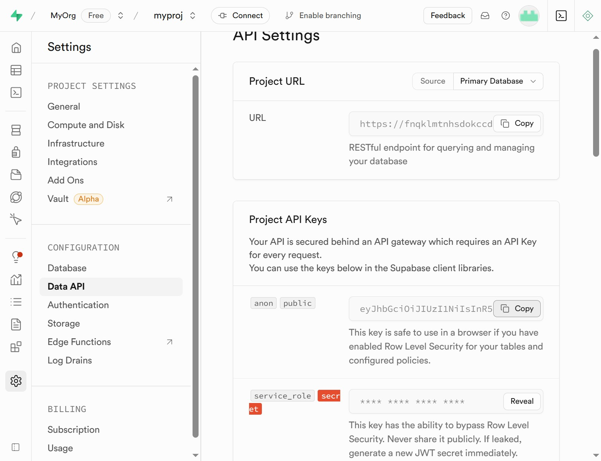
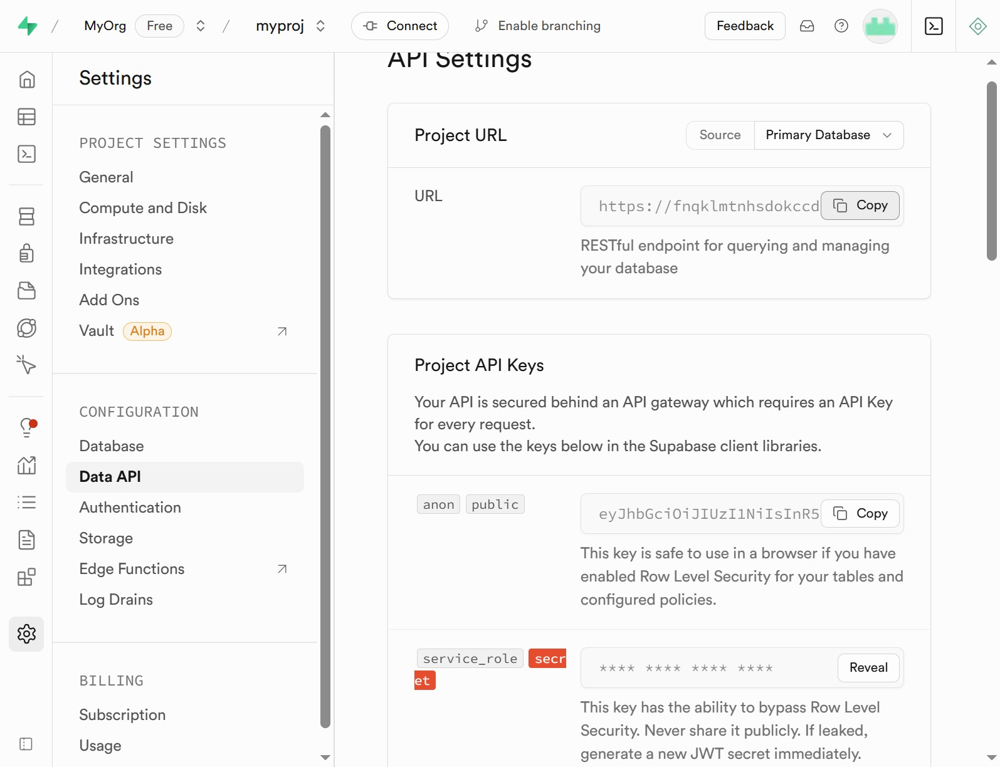

# Environment Variables

## Database Url

1. Navigate to the supabase dashboard
   
2. Click 'connect'
   
3. Copy the database URL
   
   Note that the database password is missing. While most secrets are availible via the dashboard, the supabase password is only availibe when creating the project.

If you forgot the password, you can reset your database password from [the database settings](https://supabase.com/dashboard/project/_/settings/database) page on the project dashboard.

The URL and password together make the DATABASE_URL env variable.

## Public Supabase Anon Key

1. On the supabase dashboard, click project settings from the left-most menu.
   
2. Click Data API from options on the settings menu.
   
3. Copy the anon public key (this is the NEXT_PUBLIC_SUPABASE_ANON_KEY in the .env file)
   
4. Copy the URL (this is the NEXT_PUBLIC_SUPABASE_URL in the .env file)
   
